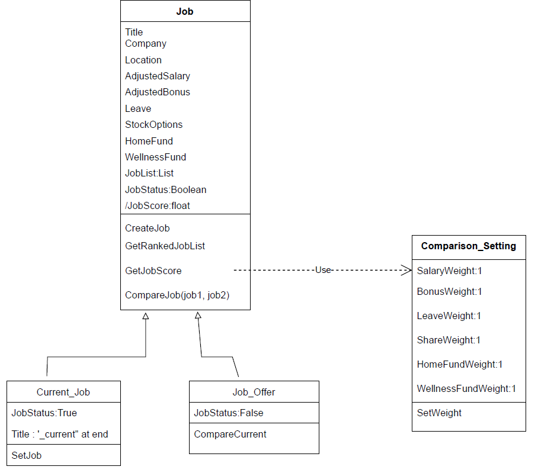
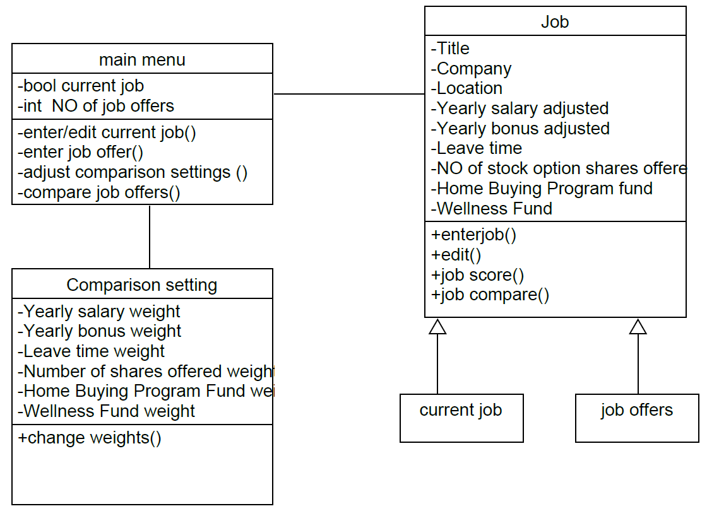
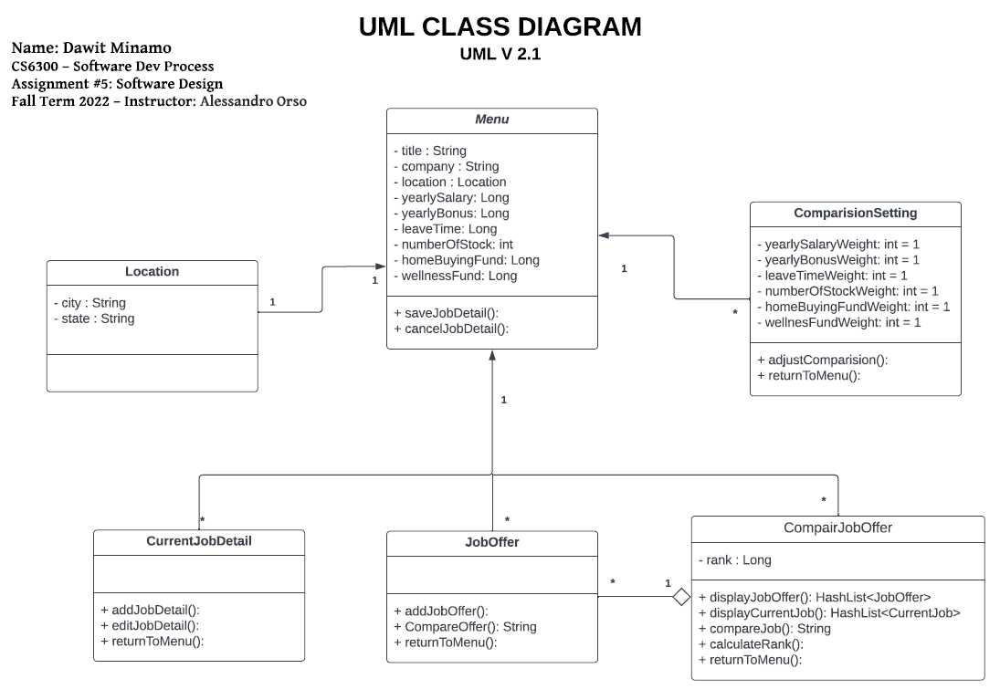
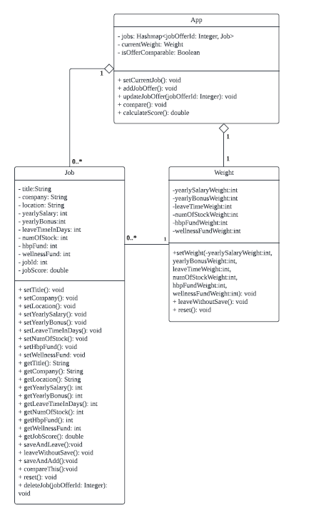
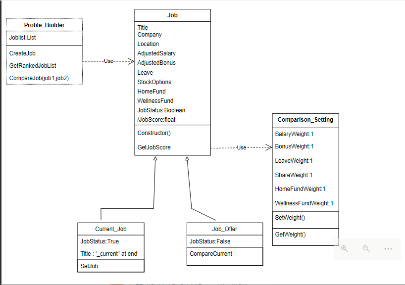
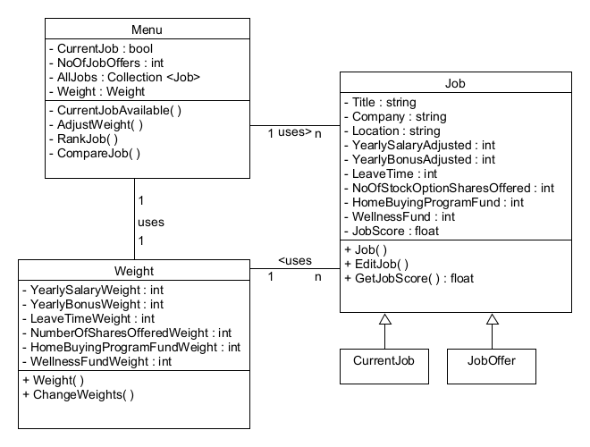

<h2>Individual Design Review</h2>

Design 1(xtang7)

Pros:
the design looks hava almost all classes
The design considers current job and job offer as generalization of job
Comparison setting indicates initial valve for weights
cons:
switching profile_builde with menu class would be better since menu is mentioned on the requirement
-class names should follow naming convention i.e Current_Job ->Current_Job
-access modifier should require which is public(+), private(-) etc.
-for comparision_setting class one line separator is enough between attribute and method
The arrow sign (use) between Profile_Builder and Job is not necessary since this is not a use case diagram.
-constructor, setter and getter method is not required to mention on class diagrams; it's known by default.

Design 2(jdong319)

Pros:
Main menu looks good/complete
The design contains all the necessary classes
Cons:
Methods should be public so change private(-) sign to public(+)
Job should be an abstract class so that currentJob and JobOffer class can inherit the methods and attributes.
The attribute value for ComparisionSetting class should be initially defined which is 1 as per the requirement
the name for class, attribute and method should follow java naming convention
Job needs more method that displays current or list of job offer

Design 3(dminamo3)

Pros:
Have many details thinking that can be used for implementation
The design have all class to realize the requirement
Design indicates data type for class attributes
Comparison setting indicates initial valve for weights
Cons:

UI interface redirection and display are UI side stuff, not need to include on UML design
Some classes can be combined

Design 4(bwan33)

Pros:
Main structure is complete
Very detailed
Job assigned Id for easy manage job offers

Cons:
Many methods in Job class ,can be wrap to one
leaveWithoutSave, reset methods are UI side stuff, not needed in UML

<h2>Team Design</h2>

InitialDesign

FinalDesign

As per our discussion some of a commonalities are; we identified that the MainMenu class is the class that represents the entry point to the system and that ties the various pieces together, Job and Comparison classes are common classes for all individual design, attributes name on Job and ComparisonSetting classes are pretty much similar with individual design. The design structure and relationship between classes are the common ones as well.
To come up with the team design first we discussed pros and cons on the individual design section, and we selected one design which is attached on images/initialDesign.png as a baseline. We discussed the data structure that used to hold the job information and we decided Map is a preferable data structure in terms of flexibility, time complexity and functionality. We added all the main functionality to the main menu class since this class is the entry point of the system, so that the user can enter/edit the current job, enter job offer, adjust comparison setting and compare job offer. We used the common classes Job and ComparisionSettign classes in design and Job is a parent class for CurrentJob and JobOffer classes. The final crafted team design images are found in images/finalDesign.png.

<h2>Summary</h2>

A few lessons learned during  team discussion and review each other work:

Design lesson 1  is to add  implementation detail in UML design. For example,

backend methods  with UI side action, such as  reset input fields and page redirection (they are implementation details) ;
Data structure selection when define attribute
UML is used to capture major backend classes(attribute, operations) and their  relationship.

Design lesson 2  is  trying  to associate  each front end step with a  backend method ,but not every action of the front end is associated with a method on UML, such as page redirection.

Design lesson 3 is some operations not specified by requirement are raised during the discussion. These operations can make app robus and easy to use. For the current phase, they are not priorities but good to consider at implementation.

Team collaboration:  some team members are detail-oriented, some are big picture focused. With each member’s input, we made the design more complete and also wrote down several good  ideas for future implementation.

Team Conflict: Disagreements happened several times, with each side presenting their thought, debate and rethink, it provided us a good opportunity to learn from  each other.

Team communication tool: We explored several communication tools, such as slack, and teams. We finally go with microsoft teams which can host longer than 1 hour meetings if we register with school email.

Time coordination : Team members are in different time zones, we used when2meet to find the time overlap, finalized team meeting time.

