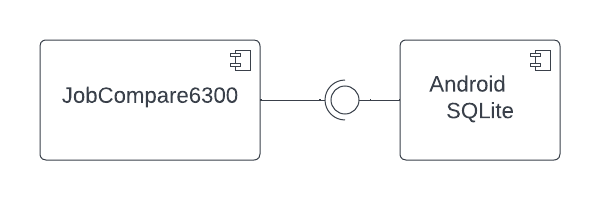
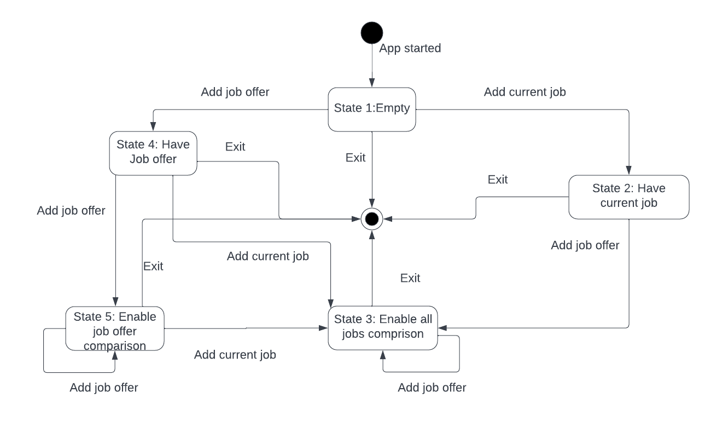
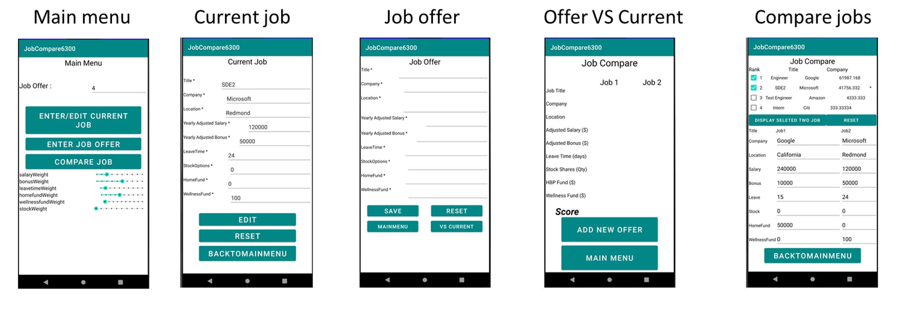

# Design Document

**Author**: \<Jun Dong\>

## 1 Design Considerations

### 1.1 Assumptions

This app will be deployed on a mobile device with Android operating system. The app is intended to be used by a single user for comparing new job offers.
Services offered by Android such as location, internet connection are not utilized by the app except for Android SQLite. The app uses Android SQLite to store the user's data.

### 1.2 Constraints

This app is designed for Android system. The app design must rely on service provided by Android system and written in Java.

### 1.3 System Environment

This app must be run by an Android mobile device with Android version higher than (include) 10.0 or API level higher than 29.

## 2 Architectural Design

### 2.1 Component Diagram

This Job comparison app is a simple system and it only uses Android SQLite for DB service. Two components are shown in the diagram. One is the app for comparing job offers, and the
other is Android SQLite. The app requires the service of Android SQLite to store user's data. The attributes of Job class and Weight class are saved in two separate tables in the database.

### 2.2 Deployment Diagram

Deployment Diagram is unnecessary for this app as it will be only deployed on a single local device.

## 3 Low-Level Design

### 3.1 Class Diagram

The class diagram of the Job comparison is given below. Three classes are shown in the diagram: Menu, Job, and Weight. Menu class is the entry point of the system and it provides the methods
for required operations. Job class provides the data type or attributes of entered jobs as well as the methods to create and save a job instance. In addition, the method to evaluate a job's score 
is also a part of the functions in Job class. Weight class implements the data type of the various weights in job score calculation and it gives access to modify the values of the weights. 
The class diagram of Android SQLite is not shown as it is the service provided by Android platform.

### 3.2 Other Diagrams

This app is fairly simple and only requires DB service, so a sequence diagram is not necessary.
State transition diagram is shown below. This diagram shows the disable/enable transitions of "compare with current job" and "compare job offers" buttons. When the app first started, no job is entered by the user. It is in the empty state (State 1), the user can neither edit current job nor compare job offer. Correspondingly, the compare job offer button should be disabled and only enter current job button is shown. After entering(saved) current job (right branch), the app will allow the user to edit current job and enter job offer (State 2). In this state, "compare job offer" is still disabled. After entering at least one job offer, the app goes to the state (State 3) that allows comparing job offers and comparing job offer with current job.
On the left branch of Empty state,the app goes to "Have job offer" state (State 4) with one job offer entered. Job offer comparisons (with job offer or current job) are disabled in this state. By entering another job offer, the app goes to the state (State 5) that only allows comparing job offers. From State 5 to State 3, current job has to be entered. State 4 can directly transit to State 3 by entering current job. At any of these state, the app can be stopped by clicking exit button on main menu.

## 4 User Interface Design

The layouts for the main menu (including change weights),enter/edit current job, add job offer, compare offer with current job, and compare all jobs are given below.
