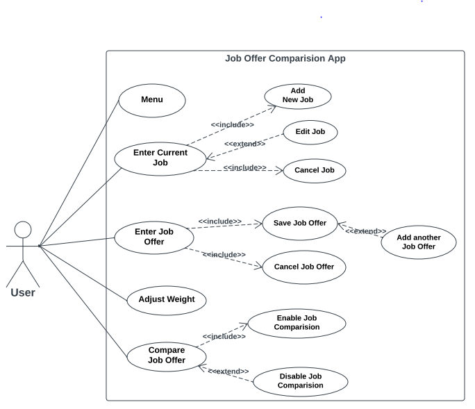

# Use Case Model
**Author**: \<Dawit Minamo\>
## 1 Use Case Diagram

 
## 2 Use Case Descriptions
## 1 Menu
- *Requirements: this is the entry point for the app system. When the app is started, the GUI will present the user with four buttons 1) enter/edit current job, 2) enter job offer,  3) adjust weight and 4) compare Job offer*
- *Pre-conditions: No pre-condition is required*
- *Post-conditions: No post-condition is required*
## 2 Enter current Job
- *Requirements: when choosing enter current job the user enter job detail if it’s first time otherwise the system display all the current job information so that the user can edit the information*

- *Pre-conditions: the user should provide these job details i. Title ii. Company iii. Location (entered as city and state) iv. Yearly salary adjusted for cost-of-living v. Yearly bonus adjusted for cost of living vi. Leave time (in days) vii. Number of stock option shares offered viii. Home Buying Program fund (one-time dollar amount up to 15% of Yearly Salary) ix. Wellness Fund ($0 to $5,000 inclusive annually.*

- *Post-conditions: the user be able to either save the job details or cancel and exit without saving, returning in both cases to the main menu. If the user save the current job "JobScore" attribute will be set to 0 as default. Meanwhile,"CurrentJob" is set to be true. Then, the displayed interface will be set to main menu. If "exit without saving" is clicked, simply set the displayed interface to main menu. *

- *Scenarios: enter current job interface or edit current job interface, is handled by "Enter/Edit current Job" button from "fragment_first.xml" interface and "FirstFragment" class has implemented to do the backend logic. these two interfaces should be the same in format. The only difference would be if the current job information is displayed or not. For enter job interface, the current job details are empty as no current job entered. Text fields corresponding to job details are (assigned) empty. For edit current job interface, the current job information are displayed by assigning values to text fields from existing current job instance.*

## 3 Enter Job Offer
- *Requirements: when choosing enter job offer the user enter all job offer detail the same information as current job.*

- *Pre-conditions: the user should provide these job details i. Title ii. Company iii. Location (entered as city and state) iv. Yearly salary adjusted for cost-of-living v. Yearly bonus adjusted for cost of living vi. Leave time (in days) vii. Number of stock option shares offered viii. Home Buying Program fund (one-time dollar amount up to 15% of Yearly Salary) ix. Wellness Fund ($0 to $5,000 inclusive annually.*

- *Post-conditions: the user be able to either save the job offer details, add another job offer or cancel and exit without saving, returning in to the main menu. If "save" is chosen, the constructor "Job" will be called to create the current job instance and "JobScore" attribute will be set to 0 as default. Meanwhile,1) "NoOfJobOffers" is increased by 1 and 2)"compare offer with current job" button will be enabled. If "cancel" is chosen, the system will display the main menu without saving the entered job offer. To enter another offer, system simply set text fields of "enter job offer" interface to empty. *

- *Scenarios: Once clicked "enter job offers" from "fragment_first.xml" interface, the displayed interface will first set to the interface for "enter job offers". This interface will be similar to "enter current job" interface (same fields would be listed to user to fill) with different operation options (or buttons).*

## 4 Adjust Weight
- *Requirements: When adjusting the weight, the user can assign integer weights to: a. Yearly salary b. Yearly bonus c. Leave time d. Number of shares offered e. Home Buying Program Fund f. Wellness Fund If no weights are assigned, all factors are considered equal. *

- *Pre-conditions: the user should inter corresponding integer value for all or anyone of these detail a. Yearly salary b. Yearly bonus c. Leave time d. Number of shares offered e. Home Buying Program Fund f. Wellness Fund to adjustment the wight. Negative values are not allowed. *

- *Post-conditions: the value of all or anyone of these a. Yearly salary b. Yearly bonus c. Leave time d. Number of shares offered e. Home Buying Program Fund f. Wellness Fund will be changed to whatever value the user enter to adjust the new weight. If no weights are assigned, all factors are considered equal. *

- *Scenarios: The use can simply adjust the wight from "fragment_first.xml" interface listed as seek bar. This value will initiallized in "FirstFragment.java" class *

## 5 Compare Job Offer
- *Requirements: After prompts are handled within the system the "GetJobScore" method will calculate and assign "JobScore" for all stored jobs. Then, the "sortJob()" method would sort all stored jobs in the "compareJobFragment.java" class as List from high to low. If "CurrentJob" is true, the current job would be shown and highlighted. Only current job would be highlighted. The system would allow user to select the ranked listing job options. "CompareJob" method will be invoked to compare two specific job, after selecting two jobs, a new interface would pop up showing the two offers' information, by utilizing getters.*

- *Pre-conditions: there should be at lease two job offer details in the system to compare. The use then should select two job offer from the list to compare*

- *Post-conditions: a new interface would pop up showing the two offers' information, by utilizing getters. The system would supply two buttons letting user to choose either be back to main menu or continue to pick another two jobs, two different interfaces would be linked to the buttons. *

- *Scenarios: When choosing to compare job offers, a user will: a. Be shown a list of job offers, displayed as Title and Company, ranked from best to worst and including the current job (if present), clearly indicated. b. Select two jobs to compare and trigger the comparison. c. Be shown a pop up comparing the two jobs, displaying, for each job offer d. Be offered to perform another comparison or go back to the main menu. *

